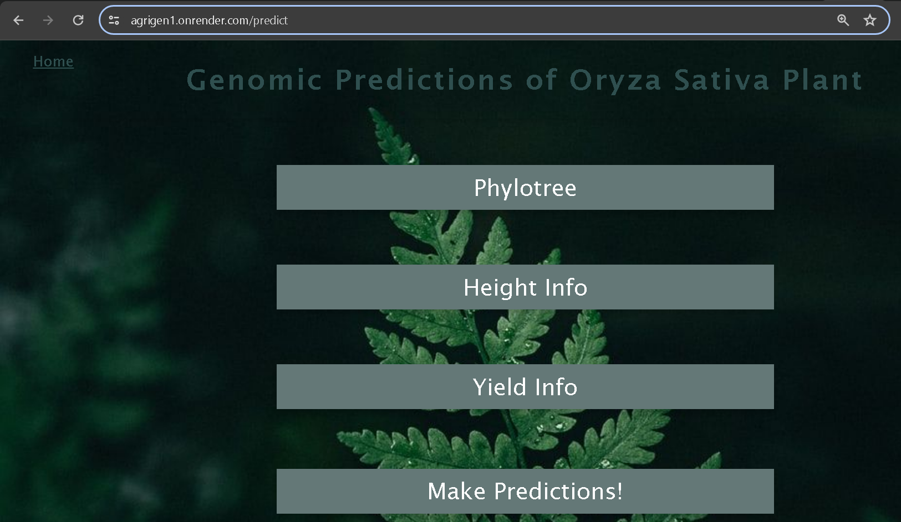

# AGRIGEN 

Leveraging machine learning and bioinformatics, this project predicts plant traits in Oryza Sativa (rice). The application integrates genomic data for accurate trait forecasting, utilizing Python, React, and Flask for a comprehensive user interface. This tool serves researchers and farmers by providing actionable insights through an intuitive web application.

## Installation 
1. git clone "https://github.com/PreranaYekkele/AgriGenomics"
2. cd AgriGenomics
3. pip install -r requirements.txt
4. python run_app.py

## deployment 

Deployed at: https://agrigen1.onrender.com/

## Contact

For any inquiries or support, please contact at [preranayekkele@gmail.com]

